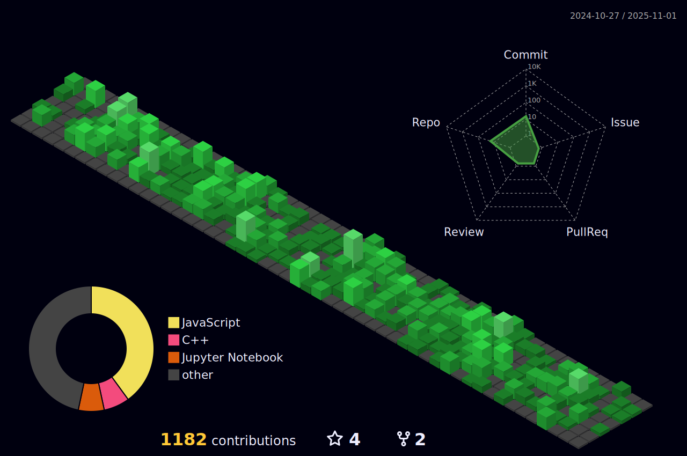

  

###

  
  
  

###

<h1 align="center">Hi! It's Muhammad Ghufran Ali 👋</h1>
<h3 align="center">A passionate full stack developer from Pakistan</h3>

###

<h3 align="left">👩‍💻  About <a href="https://ghufran2508.github.io/" target="_blank">Me</a> </h3>

###

  
---

👋 Hello there! I'm Muhammad Ghufran Ali, a passionate full-stack developer with a keen interest in pushing the boundaries of technology. You can find me in the realm of code, crafting solutions that bridge the gap between ideas and execution.

🚀 As a full-stack developer, I thrive on the challenges of both front-end and back-end development. My journey in the tech world has been an exciting adventure, and I am constantly seeking new opportunities to learn and grow. You can check out my coding escapades on my GitHub profile: [GitHub.com/ghufran2508](https://github.com/ghufran2508).

💻 Currently, I am diving into the fascinating world of DevOps, aiming to streamline and enhance the software development lifecycle. I believe in the power of automation, continuous integration, and delivery to create robust and scalable systems.

🤖 My fascination with machine learning was sparked during my undergraduate studies, where I delved into the realm of artificial intelligence and completed my Final Year Project on machine learning. Now, I'm eager to expand my horizons further by venturing into deep learning, exploring its intricacies and applications.

📚 Continuous learning is at the core of my journey. I am committed to staying abreast of the latest technologies, methodologies, and best practices. Whether it's building intuitive user interfaces, optimizing database queries, or orchestrating deployment pipelines, I love the multifaceted nature of software development.

🌐 Let's connect and collaborate! Whether you're interested in discussing the latest tech trends, exploring potential projects, or sharing insights on the world of development, I'm always open to new connections and conversations.

Happy coding! 🚀

---

###

<h3 align="left">🛠 Language and tools</h3>

###

  
  
  
  
  
  
  
  
  
  
  
  
  
  
  
  
  
  
  
  
  
  
  
  
  
  
  
  
  
  
  
  
  
  
  
  
  
  
  

# 📊 GitHub Stats:
 
 

## 🏆 GitHub Trophies

### 🔝 Top Contributed Repo

---

###

  

###

---
